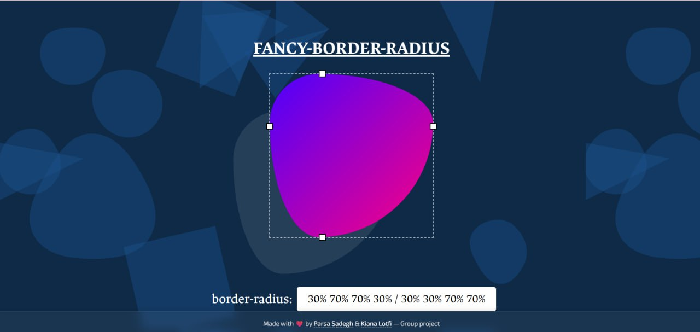

# 🎨 Fancy Border Radius Visualizer

Interactive visual playground to experiment with complex `border-radius` values — inspired by [9elements/fancy-border-radius](https://9elements.github.io/fancy-border-radius/).

## 🚀 Demo

Check the live version here:  
🔗 **[Live Demo](https://parsadgh.github.io/fancy-border-radius/)**  

---

  

---

## 🧠 Features

- Custom blob-like shape with live `border-radius` updates  
- Drag-and-drop handles on X & Y axis  
- Displays updated CSS `border-radius` value  
- Pure HTML, CSS & JavaScript — no libraries  
- Animated SVG background with glassmorphic footer  

---

## 🛠️ Technologies

- HTML5  
- CSS3 (custom styling + `backdrop-filter`)  
- Vanilla JavaScript  

---

## 🤝 Authors

Built with ❤️ by:

- [Parsa Sadegh Dastjerdi](https://github.com/Parsadgh)  
- [Kiana Lotfi](https://github.com/keyelty-dev)

This was a collaborative front-end UI experiment and fun group project 🎯

---

## 📸 Screenshot

---

